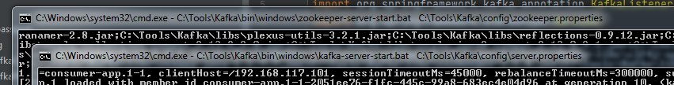
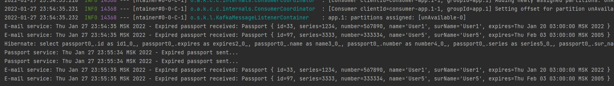

[](https://app.travis-ci.com/Azamat-Sult/job4j_rest_passport)
# job4j_rest_passport

В данном проекте реализовано приложение для управления паспортами.
Первый сервис заниматься управлением паспортами.
Доменная модель - паспорт.

````
{
   "id": 578,
   "series": 6666,
   "number": 555555,
   "name": "User5",
   "surName": "User5",
   "expires": "19.02.2022"
}
````

Поддерживаются следующие методы:

- /save, сохранить данные паспорта
- /update?id=*, обновить данные паспорта
- /delete?id=*, удалить данные паспорта
- /find, загрузить все паспорта
- /find?seria=*, загрузить паспорта с заданной серией
- /unavaliabe, загрузить паспорта чей срок вышел
- /find-replaceable, загрузить паспорта, которые нужно заменить в ближайшие 3 месяца

Второй сервис вызывает методы первого сервиса используя RestTemplate.

Данный проект показывает виды взаимодействия микросервисов.

Синхронное взаимодействие и асинхронное.

Синхронное осуществляется посредством Rest API.

Асинхронное - посредством Kafka, как брокера сообщений.

Сервис PassportService периодически (период устанавливается в настройках
приложения) проверяет базу данных на наличие просроченных паспортов.
Если найдутся просроченные паспорта, тогда они будут отправлены через
Kafka в сервис EmailService, который должен оповестить владельцев
просроченных паспортов о необходимости замены. (вместо отправки на
электронную почту реализован простой вывод в консоль)

Скриншоты:
1. Запускаем Zookeeper и Kafka.

   


2. Видим как PassportService отправляет информацию о просроченных паспортах,
с интервалом в 1 минуту, сервису EmailService.

   